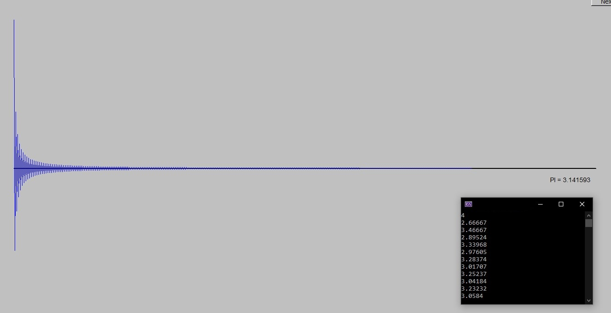

# Principles and Practice Using C++ Solutions

My solutions to "Programming: Principles and Practice Using C++" by Bjarne Stroustrup. This repository includes chapter work, try-it's, chapter reviews, drills and exercises.

In order to build the GUI programs, the FLTK library must be included and the Visual Studio project template must be included.

1. Download the FLTK source code from the [official FLTK website](https://www.fltk.org/software.php). After extracting the archive, copy the files from `fltk-1.x.x/src/` to `includes/graphics/FLTK`.

2. The project must be created or opened using the Visual Studio project template `VS_FLTK_Template` located in `includes/graphics`. To do so, zip the template folder `VS_FLTK_Template`, and add it to Visual Studio ([Guide](https://learn.microsoft.com/en-us/visualstudio/ide/how-to-create-project-templates)).

 
Meanwhile, here are some of the projects I made as exercises presented in the book ♡( ◡‿◡ )
  

</img>
</img>
</img>

</img>
</img>
</img>
